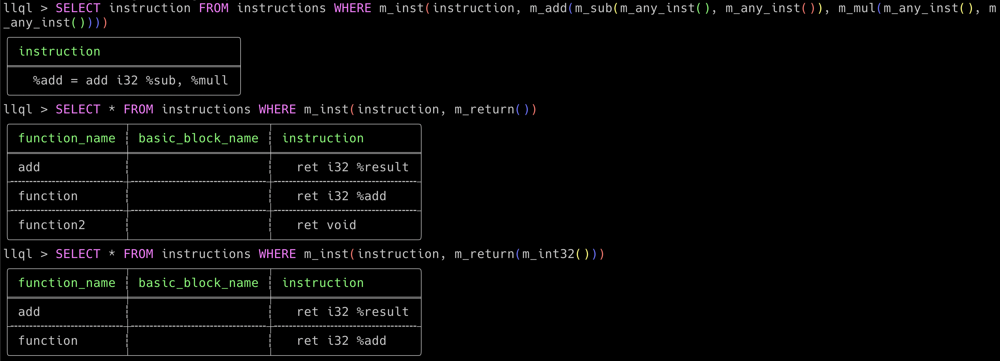

<h1 align="center">LLQL - LLVM IR/BC Query Language</h1></br>

<p align="center">

</p>

<p align="center">
  
  
  
  
</p>

<p align="center">
LLQL is a tool that allow you to run SQL-like query with Pattern matching functions inspired by LLVM InstCombine Pattern Matchers on LLVM IR/BitCode files instead of database files using the GitQL SDK.
</p>

<p align="center">
  
</p>

---

### Sample

If we have LLVM IR function like this, and we want to match `add` instruction that has result of sub instruction as Left hand side and result of mul instruction as Right hand side.

```ir
define i32 @function(i32 %a, i32 %b) {
  %sub = sub i32 %a, %b
  %mull = mul i32 %a, %b
  %add = add i32 %sub, %mull
  ret i32 %add
}
```

We can query to print the instruction with this query

```sql
SELECT instruction FROM instructions WHERE m_inst(instruction, m_add(m_sub(), m_mul()))
```

Or for example you can query how many times this pattern exists in each function

```sql
SELECT function_name, count() FROM instructions WHERE m_inst(instruction, m_add(m_sub(), m_mul())) GROUP BY function_name
```

You can also filter by number of times the value is used for example for not used values

```IR
define i32 @function(i32 %a, i32 %b) {
  %unused_add = add i32 %a, 1

  %used_twice = add i32 %a, %b
  %add2 = add i32 %used_twice, %b
  %add3 = add i32 %used_twice, %add2
  ret i32 %add3
}
```

```sql
SELECT instruction FROM instructions WHERE m_inst(instruction, m_unused(m_add()))
```

and for value that used only time

```sql
SELECT instruction FROM instructions WHERE m_inst(instruction, m_has_one_use(m_add()))
```

and for value that used n times

```sql
SELECT instruction FROM instructions WHERE m_inst(instruction, m_has_n_uses(m_add(), 2))
```

---

### Download or Install

Note that Building from source or installing from Cargo.io requires LibClang 18.0 to be installed

- Install from Cargo.io

```
cargo install llql
```

- Build from source code

```
git clone https://github.com/AmrDeveloper/LLQL.git
cd LLQL
cargo build
```

### Run LLQL

```
LLQL is a SQL like query language to run on LLVM IR/BitCode files
Usage: LLQL [OPTIONS]

Options:
  -f,  --files <paths>        Path for local files to run query on
  -s,  --script <file>        Script file contains one or more query
  -q,  --query <GQL Query>    LLQL query to run on selected files
  -p,  --pagination           Enable print result with pagination
  -ps, --pagesize             Set pagination page size [default: 10]
  -o,  --output               Set output format [render, json, csv]
  -a,  --analysis             Print Query analysis
  -e,  --editor               Enable GitQL LineEditor
  -h,  --help                 Print LLQL help
  -v,  --version              Print LLQL Current Version
```

### License

```
MIT License

Copyright (c) 2024 Amr Hesham

Permission is hereby granted, free of charge, to any person obtaining a copy
of this software and associated documentation files (the "Software"), to deal
in the Software without restriction, including without limitation the rights
to use, copy, modify, merge, publish, distribute, sublicense, and/or sell
copies of the Software, and to permit persons to whom the Software is
furnished to do so, subject to the following conditions:

The above copyright notice and this permission notice shall be included in all
copies or substantial portions of the Software.

THE SOFTWARE IS PROVIDED "AS IS", WITHOUT WARRANTY OF ANY KIND, EXPRESS OR
IMPLIED, INCLUDING BUT NOT LIMITED TO THE WARRANTIES OF MERCHANTABILITY,
FITNESS FOR A PARTICULAR PURPOSE AND NONINFRINGEMENT. IN NO EVENT SHALL THE
AUTHORS OR COPYRIGHT HOLDERS BE LIABLE FOR ANY CLAIM, DAMAGES OR OTHER
LIABILITY, WHETHER IN AN ACTION OF CONTRACT, TORT OR OTHERWISE, ARISING FROM,
OUT OF OR IN CONNECTION WITH THE SOFTWARE OR THE USE OR OTHER DEALINGS IN THE
SOFTWARE.
```